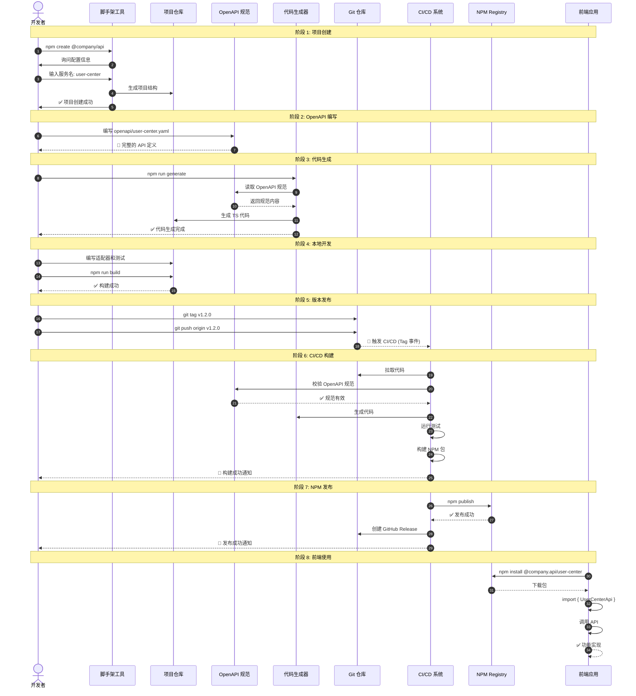
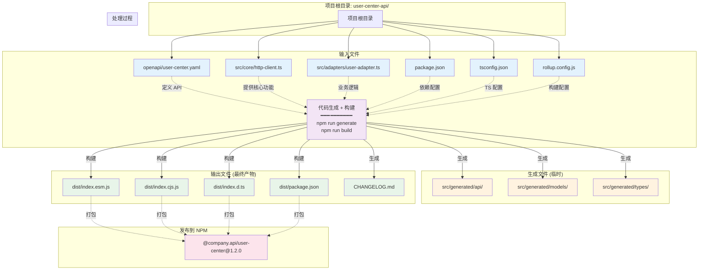
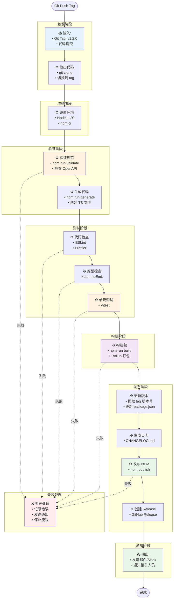
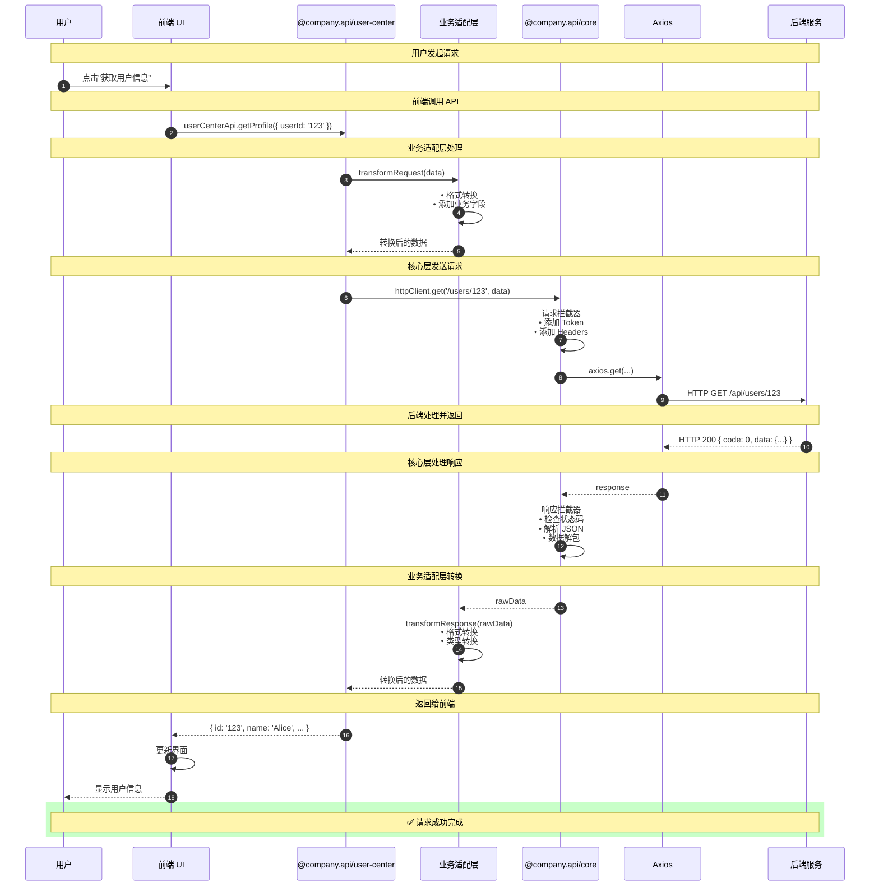
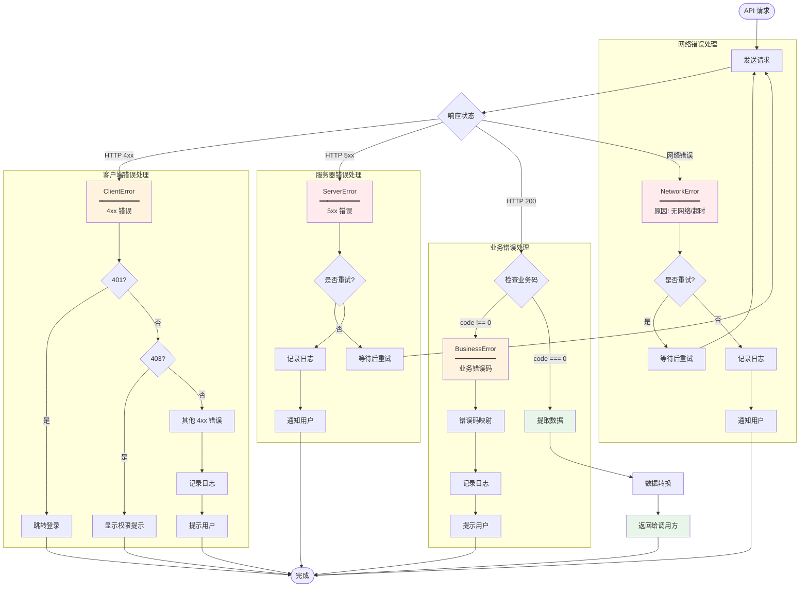
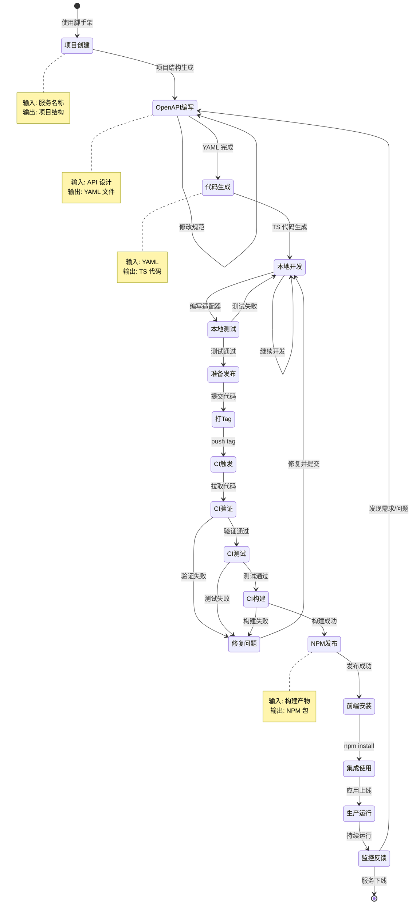

# 流程关系与输入输出图示

本文档提供详细的图示，说明各个流程的关系、输入输出和数据流向。

---

## 1. 整体流程关系图

```mermaid
graph TB
    subgraph "阶段 1: 项目创建"
        A1[开发者使用脚手架]
        A2[输入: 服务名称]
        A3[输出: 标准化项目]
    end
    
    subgraph "阶段 2: OpenAPI 维护"
        B1[团队维护 YAML 文件]
        B2[输入: API 设计]
        B3[输出: OpenAPI 规范]
    end
    
    subgraph "阶段 3: 代码生成"
        C1[执行代码生成脚本]
        C2[输入: OpenAPI YAML]
        C3[输出: TS 类型和 API 函数]
    end
    
    subgraph "阶段 4: 本地开发"
        D1[开发和测试]
        D2[输入: 生成的代码]
        D3[输出: 完整的 API 包]
    end
    
    subgraph "阶段 5: 版本发布"
        E1[打 Git Tag]
        E2[输入: 项目代码 + Tag]
        E3[输出: 触发 CI/CD]
    end
    
    subgraph "阶段 6: CI/CD 构建"
        F1[自动构建和测试]
        F2[输入: 代码 + Tag]
        F3[输出: NPM 包]
    end
    
    subgraph "阶段 7: NPM 发布"
        G1[发布到 NPM Registry]
        G2[输入: 构建产物]
        G3[输出: 可安装的包]
    end
    
    subgraph "阶段 8: 前端集成"
        H1[前端应用安装使用]
        H2[输入: NPM 包]
        H3[输出: 类型安全的 API 调用]
    end
    
    A1 --> A2 --> A3
    A3 --> B1
    B1 --> B2 --> B3
    B3 --> C1
    C1 --> C2 --> C3
    C3 --> D1
    D1 --> D2 --> D3
    D3 --> E1
    E1 --> E2 --> E3
    E3 --> F1
    F1 --> F2 --> F3
    F3 --> G1
    G1 --> G2 --> G3
    G3 --> H1
    H1 --> H2 --> H3
    
    style A1 fill:#e1f5ff
    style B1 fill:#fff4e1
    style C1 fill:#ffe1f5
    style D1 fill:#f5ffe1
    style E1 fill:#ffe1e1
    style F1 fill:#e1e1ff
    style G1 fill:#ffe1ff
    style H1 fill:#e1ffe1
```



---

## 2. 详细输入输出流程图

```mermaid
flowchart TD
    Start([开始]) --> Input1

    subgraph Stage1 ["🔨 阶段 1: 项目创建"]
        Input1["📥 输入:<br/>• 服务名称 (user-center)<br/>• 配置选项"]
        Process1["⚙️ 处理:<br/>• 脚手架生成项目结构<br/>• 创建配置文件<br/>• 初始化 Git 仓库"]
        Output1["📤 输出:<br/>• 项目目录: user-center-api/<br/>• package.json<br/>• CI/CD 配置<br/>• 空的 openapi/ 目录"]
        Input1 --> Process1 --> Output1
    end

    Output1 --> Input2

    subgraph Stage2 ["📝 阶段 2: OpenAPI 编写"]
        Input2["📥 输入:<br/>• API 设计需求<br/>• 后端接口文档"]
        Process2["⚙️ 处理:<br/>• 编写 OpenAPI 规范<br/>• 定义 paths, schemas<br/>• 添加文档说明"]
        Output2["📤 输出:<br/>• openapi/user-center.yaml<br/>• 完整的 API 定义"]
        Input2 --> Process2 --> Output2
    end

    Output2 --> Input3

    subgraph Stage3 ["🔄 阶段 3: 代码生成"]
        Input3["📥 输入:<br/>• OpenAPI YAML 文件<br/>• 代码生成配置"]
        Process3["⚙️ 处理:<br/>• swagger-typescript-api<br/>• 解析 OpenAPI 规范<br/>• 生成 TS 代码"]
        Output3["📤 输出:<br/>• src/generated/api/<br/>• src/generated/models/<br/>• src/generated/types/<br/>• TypeScript 类型定义"]
        Input3 --> Process3 --> Output3
    end

    Output3 --> Input4

    subgraph Stage4 ["💻 阶段 4: 本地开发"]
        Input4["📥 输入:<br/>• 生成的代码<br/>• 核心层依赖"]
        Process4["⚙️ 处理:<br/>• 编写适配器<br/>• 添加测试<br/>• 本地调试"]
        Output4["📤 输出:<br/>• 完整的 src/ 目录<br/>• 测试用例<br/>• 准备发布的代码"]
        Input4 --> Process4 --> Output4
    end

    Output4 --> Input5

    subgraph Stage5 ["🏷️ 阶段 5: 打标签"]
        Input5["📥 输入:<br/>• 完成的代码<br/>• 版本号"]
        Process5["⚙️ 处理:<br/>• git tag v1.2.0<br/>• git push origin v1.2.0"]
        Output5["📤 输出:<br/>• Git Tag<br/>• 触发 CI/CD"]
        Input5 --> Process5 --> Output5
    end

    Output5 --> Input6

    subgraph Stage6 ["🤖 阶段 6: CI/CD"]
        Input6["📥 输入:<br/>• Git 仓库<br/>• Git Tag<br/>• CI/CD 配置"]
        Process6["⚙️ 处理:<br/>• 校验 OpenAPI<br/>• 生成代码<br/>• 运行测试<br/>• 构建 NPM 包"]
        Output6["📤 输出:<br/>• dist/ 构建产物<br/>• .tgz 包文件<br/>• Changelog"]
        Input6 --> Process6 --> Output6
    end

    Output6 --> Input7

    subgraph Stage7 ["📦 阶段 7: NPM 发布"]
        Input7["📥 输入:<br/>• 构建产物<br/>• NPM Token<br/>• package.json"]
        Process7["⚙️ 处理:<br/>• npm publish<br/>• 发布到 Registry<br/>• 创建 Release"]
        Output7["📤 输出:<br/>• @company.api/user-center@1.2.0<br/>• NPM 页面<br/>• GitHub Release"]
        Input7 --> Process7 --> Output7
    end

    Output7 --> Input8

    subgraph Stage8 ["🎯 阶段 8: 前端使用"]
        Input8["📥 输入:<br/>• NPM 包<br/>• 前端项目"]
        Process8["⚙️ 处理:<br/>• npm install<br/>• 导入 API<br/>• 调用接口"]
        Output8["📤 输出:<br/>• 类型安全的 API 调用<br/>• 业务功能实现"]
        Input8 --> Process8 --> Output8
    end

    Output8 --> End([结束])

    classDef inputStyle fill:#e3f2fd,stroke:#1976d2,stroke-width:2px
    classDef processStyle fill:#fff3e0,stroke:#f57c00,stroke-width:2px
    classDef outputStyle fill:#e8f5e9,stroke:#388e3c,stroke-width:2px
    
    class Input1,Input2,Input3,Input4,Input5,Input6,Input7,Input8 inputStyle
    class Process1,Process2,Process3,Process4,Process5,Process6,Process7,Process8 processStyle
    class Output1,Output2,Output3,Output4,Output5,Output6,Output7,Output8 outputStyle
```



---

## 3. 角色交互序列图



---

## 4. 数据流转详细图

```mermaid
graph LR
    subgraph "源头"
        A1[后端 API 设计]
    end
    
    subgraph "OpenAPI 规范"
        B1[openapi/user-center.yaml]
        B2["内容:<br/>- paths<br/>- schemas<br/>- parameters<br/>- responses"]
    end
    
    subgraph "代码生成"
        C1[swagger-typescript-api]
        C2["生成:<br/>- TypeScript 接口<br/>- API 函数<br/>- 数据模型"]
    end
    
    subgraph "核心层"
        D1[@company.api/core]
        D2["提供:<br/>- HttpClient<br/>- 拦截器<br/>- 错误处理"]
    end
    
    subgraph "业务适配"
        E1[src/adapters/]
        E2["定制:<br/>- 数据转换<br/>- 业务逻辑<br/>- 缓存策略"]
    end
    
    subgraph "构建产物"
        F1[dist/]
        F2["包含:<br/>- index.esm.js<br/>- index.cjs.js<br/>- index.d.ts"]
    end
    
    subgraph "NPM 包"
        G1[@company.api/user-center]
        G2["版本: 1.2.0<br/>大小: ~50KB"]
    end
    
    subgraph "前端应用"
        H1[业务代码]
        H2["使用:<br/>- 导入 API<br/>- 调用方法<br/>- 处理响应"]
    end
    
    A1 -->|设计| B1
    B1 -->|规范定义| B2
    B2 -->|输入| C1
    C1 -->|生成代码| C2
    C2 -->|依赖| D1
    D1 -->|提供能力| D2
    D2 -->|集成| E1
    E1 -->|添加逻辑| E2
    E2 -->|构建| F1
    F1 -->|打包| F2
    F2 -->|发布| G1
    G1 -->|版本信息| G2
    G2 -->|安装| H1
    H1 -->|集成使用| H2
    
    style A1 fill:#ffebee
    style B1 fill:#e3f2fd
    style C1 fill:#f3e5f5
    style D1 fill:#e8f5e9
    style E1 fill:#fff3e0
    style F1 fill:#fce4ec
    style G1 fill:#e0f2f1
    style H1 fill:#f1f8e9
```

---

## 5. 文件系统输入输出图



---

## 6. CI/CD 流程详细图



---

## 7. 包依赖关系图

```mermaid
graph TD
    subgraph "NPM Registry"
        Core[@company.api/core<br/>━━━━━━━━━━<br/>版本: 2.0.0<br/>提供: 核心功能]
    end
    
    subgraph "API 包们"
        UserCenter[@company.api/user-center<br/>━━━━━━━━━━<br/>版本: 1.2.0<br/>依赖: core ^2.0.0]
        Order[@company.api/order<br/>━━━━━━━━━━<br/>版本: 2.1.0<br/>依赖: core ^2.0.0]
        Payment[@company.api/payment<br/>━━━━━━━━━━<br/>版本: 1.0.5<br/>依赖: core ^2.0.0]
    end
    
    subgraph "前端应用"
        WebApp[Web 应用<br/>━━━━━━━━━━<br/>安装:<br/>- @company.api/core<br/>- @company.api/user-center<br/>- @company.api/order]
        MobileApp[移动端应用<br/>━━━━━━━━━━<br/>安装:<br/>- @company.api/core<br/>- @company.api/payment]
    end
    
    Core -->|提供基础能力| UserCenter
    Core -->|提供基础能力| Order
    Core -->|提供基础能力| Payment
    
    UserCenter -->|使用| WebApp
    Order -->|使用| WebApp
    Core -->|使用| WebApp
    
    Payment -->|使用| MobileApp
    Core -->|使用| MobileApp
    
    style Core fill:#e8f5e9
    style UserCenter fill:#e3f2fd
    style Order fill:#e3f2fd
    style Payment fill:#e3f2fd
    style WebApp fill:#fff3e0
    style MobileApp fill:#fff3e0
```

---

## 8. 运行时数据流图



---

## 9. 错误处理流程图



---

## 10. 完整生命周期状态图



---

## 总结

本文档提供了 10 个详细的图示，涵盖：

1. ✅ **整体流程关系** - 8 个阶段的关系
2. ✅ **详细输入输出** - 每个阶段的输入、处理、输出
3. ✅ **角色交互序列** - 开发者、工具、系统之间的交互
4. ✅ **数据流转** - 从设计到使用的完整数据流
5. ✅ **文件系统** - 输入文件和输出文件的关系
6. ✅ **CI/CD 流程** - 自动化构建和发布的详细步骤
7. ✅ **包依赖关系** - NPM 包之间的依赖
8. ✅ **运行时数据流** - API 调用的完整过程
9. ✅ **错误处理** - 各种错误的处理流程
10. ✅ **完整生命周期** - 从创建到运行的状态转换

这些图示可以帮助团队成员快速理解整个系统的工作原理和各个环节的关系。

---

**文档版本**: 1.0  
**最后更新**: 2025-10-30  
**作者**: API Client Team
