# API Client 工作流 - 可视化图表

本文档使用 Mermaid 图表语法展示工作流，可以在支持 Mermaid 的 Markdown 查看器中渲染（如 GitHub、GitLab、Notion、Typora 等）。

---

## 1. 整体架构图

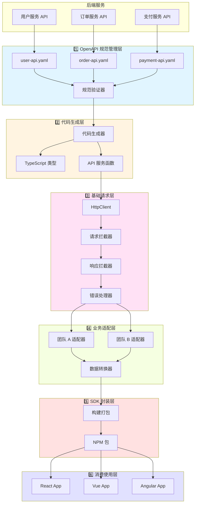

---

## 2. 开发时序图（SDK 生成流程）

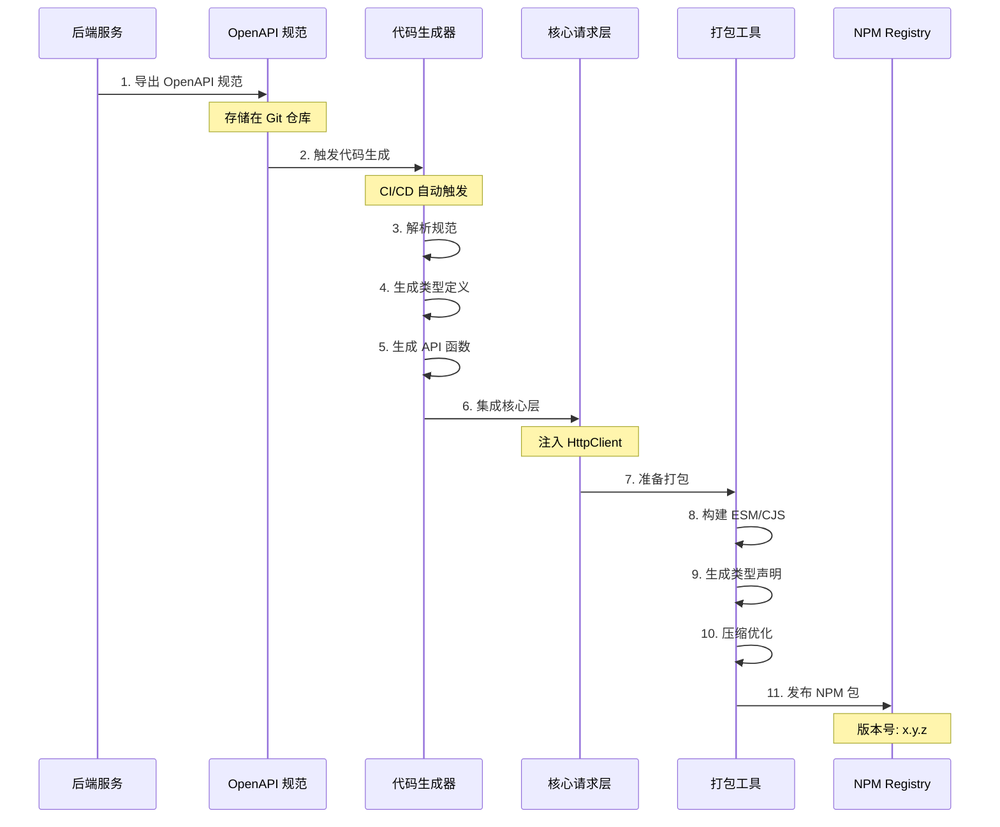

---

## 3. 运行时序图（API 调用流程）

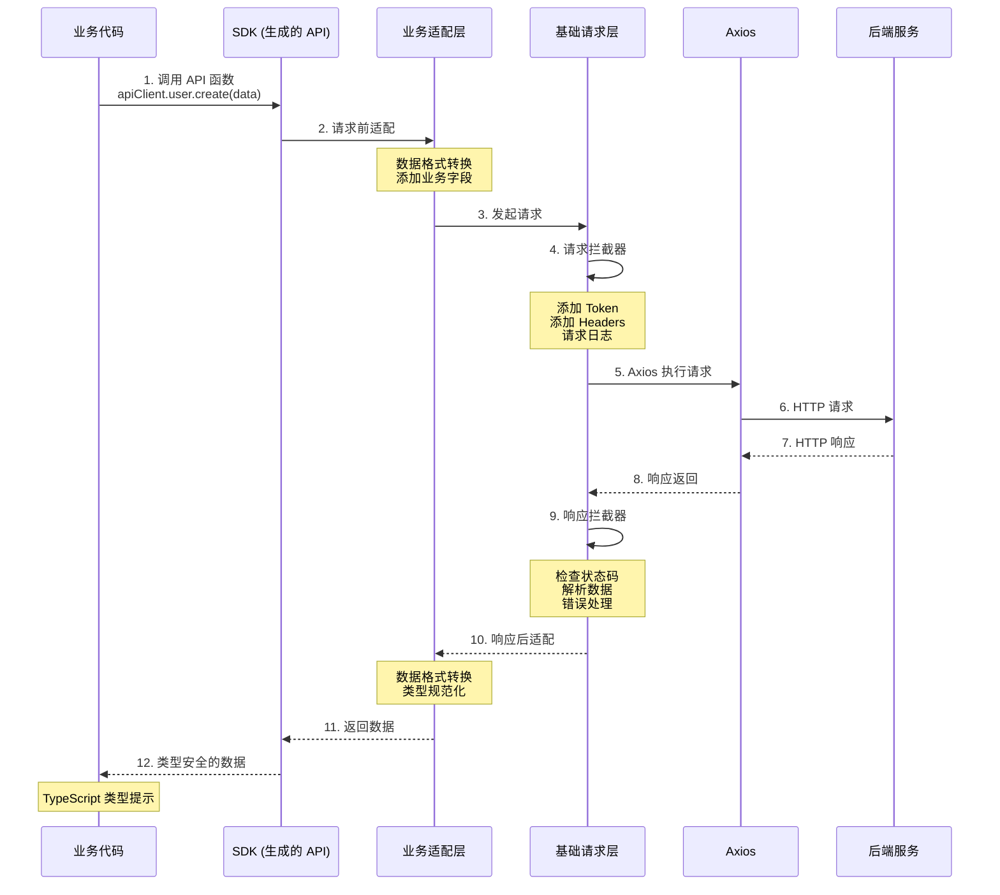

---

## 4. 错误处理流程图

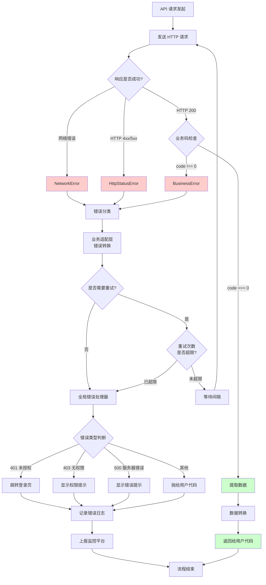

---

## 5. 配置优先级层次图

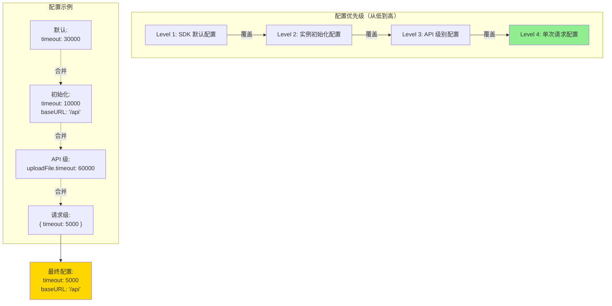

---

## 6. 插件系统架构图

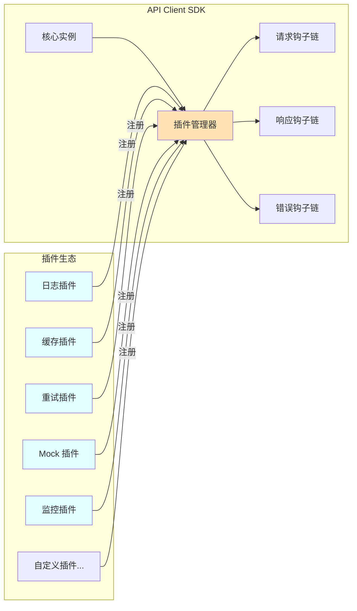

---

## 7. 多包策略对比

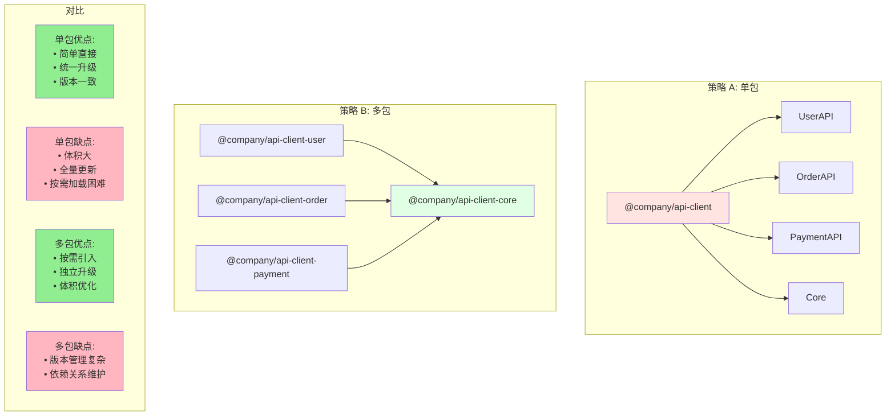

---

## 8. 版本发布流程图

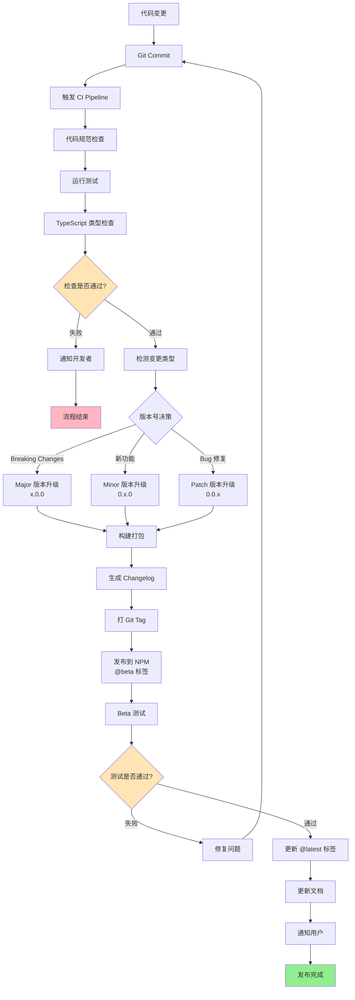

---

## 9. 数据转换流程（Request & Response）

```mermaid
graph LR
    subgraph Request["请求数据转换"]
        R1[用户代码<br/>驼峰命名<br/>{ userName: 'Alice' }]
        R2[业务适配层<br/>下划线命名<br/>{ user_name: 'Alice' }]
        R3[添加业务字段<br/>{ user_name: 'Alice'<br/>tenant_id: 'xxx' }]
        R4[序列化 JSON<br/>'{"user_name":"Alice",...}']
        
        R1 --> R2
        R2 --> R3
        R3 --> R4
        R4 --> SERVER[发送到服务器]
    end
    
    subgraph Response["响应数据转换"]
        SERVER2[接收服务器响应] --> S1
        S1['{"code":0,"data":{...}}']
        S2[解析 JSON<br/>检查业务码]
        S3[提取 data<br/>{ user_name: 'Alice'<br/>created_at: '2025-10-30' }]
        S4[格式转换<br/>{ userName: 'Alice'<br/>createdAt: Date }]
        S5[返回用户代码<br/>类型安全]
        
        S1 --> S2
        S2 --> S3
        S3 --> S4
        S4 --> S5
    end
    
    style R1 fill:#E1F5FF
    style S5 fill:#E1F5FF
    style SERVER fill:#FFE4B5
    style SERVER2 fill:#FFE4B5
```

---

## 10. 团队使用场景图

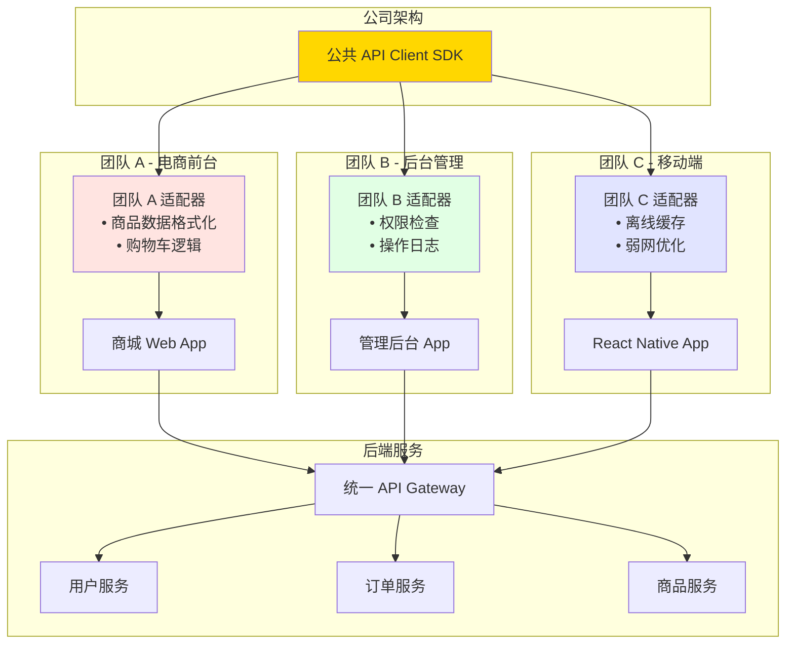

---

## 11. 完整生命周期图

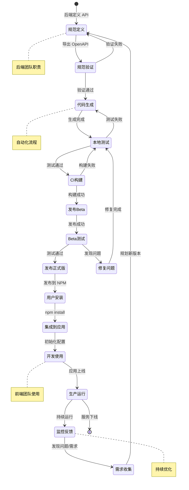

---

## 12. 技术栈选型对比

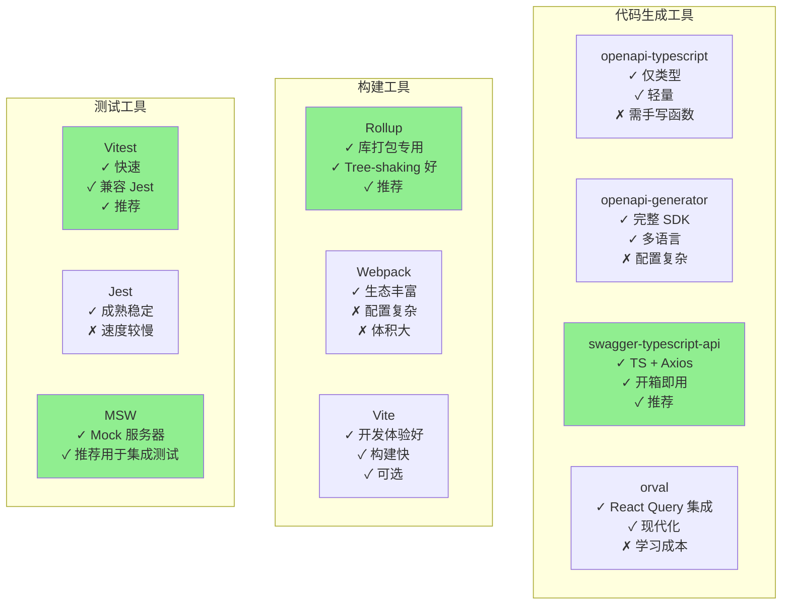

---

## 使用说明

### 在 Markdown 查看器中查看

这些图表使用 Mermaid 语法编写，可以在以下平台直接渲染：

1. **GitHub / GitLab**: 直接预览 README.md
2. **VS Code**: 安装 "Markdown Preview Mermaid Support" 插件
3. **Typora**: 内置支持 Mermaid
4. **Notion**: 使用 Mermaid 代码块
5. **在线工具**: https://mermaid.live/

### 导出为图片

访问 https://mermaid.live/ 并粘贴图表代码，可以导出为 PNG/SVG。

---

## 总结

通过这些可视化图表，我们可以清晰地看到：

1. **架构层次**: 6 个清晰的层次，职责分明
2. **数据流向**: 从 OpenAPI 到最终用户的完整流程
3. **错误处理**: 多级错误处理和恢复机制
4. **扩展能力**: 插件系统和适配器的灵活性
5. **版本管理**: 完整的 CI/CD 和发布流程
6. **团队协作**: 多团队共享基础能力，各自扩展

这套工作流设计充分考虑了：
- ✅ 自动化程度
- ✅ 类型安全
- ✅ 可扩展性
- ✅ 可维护性
- ✅ 团队协作
- ✅ 持续优化
